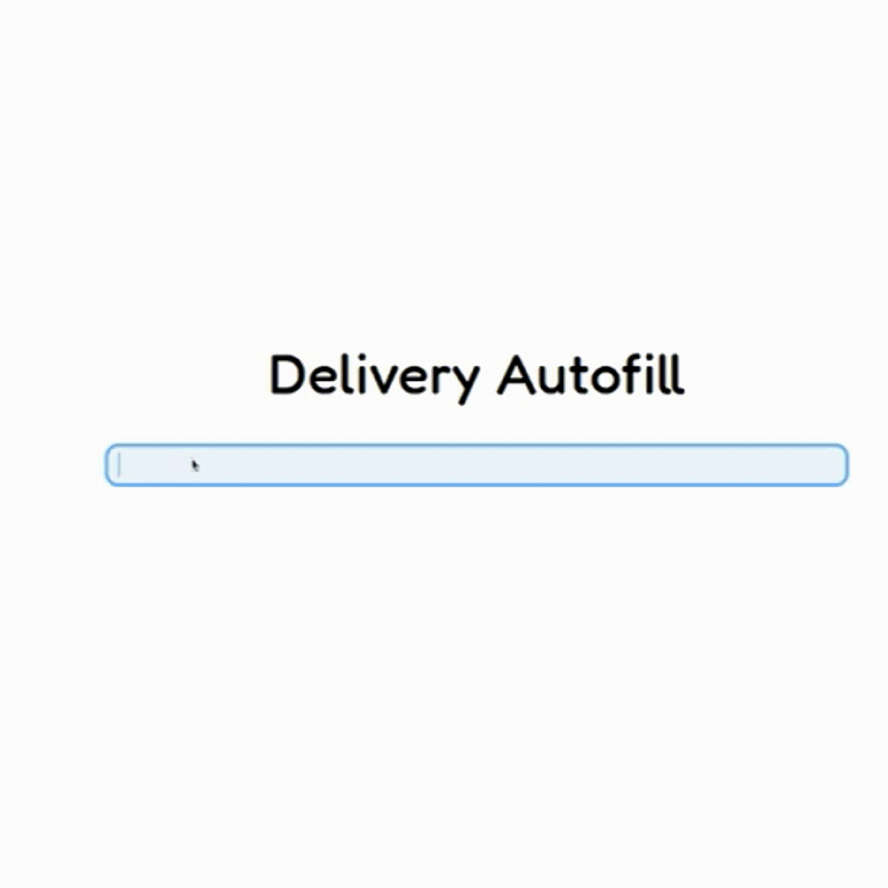

# Автокомплит поисковой строки



## **Полное описание проекта в [Notion](https://hissing-marlin-290.notion.site/ML_Autofill_the_search_bar-a4c2630514a64bfd9b0b2bba984dadc0?pvs=4)**

КРАТКО О ПРОЕКТЕ
  - **Задача**: создание сервиса по автоматическому заполнению поисковой сроки поиска продуктов.
  - **Датасет**: Delivery Hero Recommendation Dataset Singapore
  - **Модель**: CharRNN 


## Для запуска проекта

### 1. Клонируем репеозиторий

```
git clone https://github.com/dariakrtn/Autofill_the_search_bar.git
cd deep-autocomplete
```

Выполняется локально

Рекомендуется использовать виртуальную среду python либо с condor, даже для серверной части.

### 2. Запуск backend

```
cd backend
pip install -r requirements.txt
uvicorn app.main:app --host localhost --port 8000

```

### 3. Запуск frontend 

```
cd frontend
npm install
npm run serve
```

